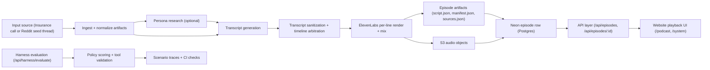
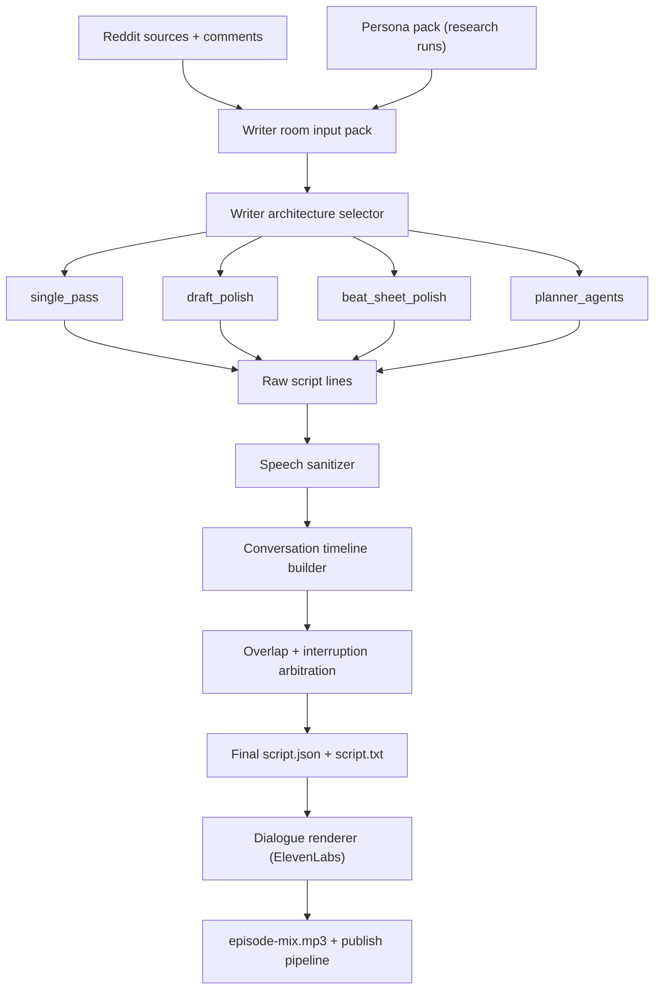

# Voice Agent Starter (Insurance Leads)

This repository provides a production-oriented starter for an insurance lead voice agent using ElevenLabs, with a local harness for behavior and tool-call validation.

## High-level walkthrough

1. Configure environment and providers (`.env`) for OpenAI, ElevenLabs, storage, and database.
2. Ingest source material:
   - Insurance mode: run harness scenarios and tool dispatch flows.
   - Podcast mode: scrape one seed Reddit thread or subreddit listings.
3. Normalize source artifacts (`sources.json`, seed thread metadata, thread tree).
4. Optionally run persona research to build speaker profiles from web artifacts.
5. Generate transcript lines with the writer architecture (single pass, draft/polish, beat sheet, or planner+agents).
6. Sanitize transcript lines for spoken output and build timing/arbitration timeline.
7. Render line audio with ElevenLabs and mix episode chunks.
8. Publish artifacts/audio to S3 + Neon, then serve through `/api/episodes` in the web UI.

## System architecture (end-to-end)



## Podcast conversation generator architecture



## What is included

- Express backend with:
  - `POST /api/tools/dispatch` for validated tool execution
  - `POST /api/harness/evaluate` for transcript scoring
- Conversation policy (`config/insurance-policy.json`)
- Scenario harness (`harness/scenarios.json` + traces)
- Tool schemas and policy checks for:
  - `upsert_lead`
  - `set_do_not_call`
  - `schedule_callback`
  - `handoff_to_licensed_agent`
- CI-friendly CLI harness runner

## Quick start

```bash
npm install
npm run test
npm run harness:run
npm run dev
```

Then open:

- `http://localhost:3000` (project home)
- `http://localhost:3000/podcast/` (episode library)
- `http://localhost:3000/system/` (system diagram)

## Required environment variables

Set these in `.env`:

- `ELEVENLABS_API_KEY`

Optional values are documented in `.env.example`.

## Suggested next steps

1. Replace mock tool dispatcher responses with CRM / dialer integrations.
2. Add scenarios for objection handling, transfer failures, and callback no-shows.
3. Add provider-side evals (`elevenlabs agents test <agent_id>`) in CI.

## Reddit podcast pipeline

This repository also includes a second workflow for entertainment content:

- Ingest subreddit posts/comments
- Or ingest one ad hoc seed thread via `--seedThread <reddit-url>`
- Or run dedicated metadata-preserving scrape via `npm run reddit:scrape`
- Optionally run LLM-driven web research to build speaker persona packs
- Build a rich multi-speaker comedy-panel script with LLM writer-room banter
- Render audio through ElevenLabs text-to-dialogue

See:

- `/Users/saulrichardson/projects/voice-agent/docs/PODCAST_PIPELINE.md`

## Website + episode publishing

The website can run in two modes:

- `EPISODES_STORE=fs` (default): reads from `output/episodes/*` and serves audio at `/local-episodes/...`
- `EPISODES_STORE=postgres`: reads from `podcast_episodes` in Postgres (Neon)

To publish an episode directory (upload to S3 + upsert to Neon):

```bash
npm run site:migrate
npm run site:publish-episode -- --episodeDir output/episodes/<episodeId>
```

## Legal/compliance note

This repo includes baseline guardrails for sales conversations (for example, DNC handling and non-binding language), but it is not legal advice. Validate scripts and policy rules with counsel before production use.
